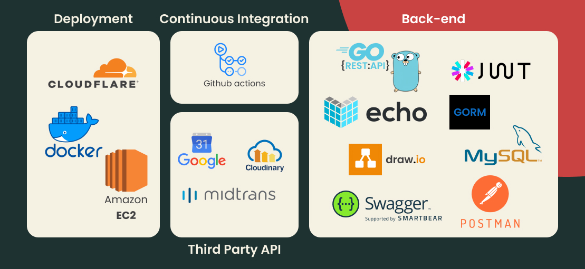
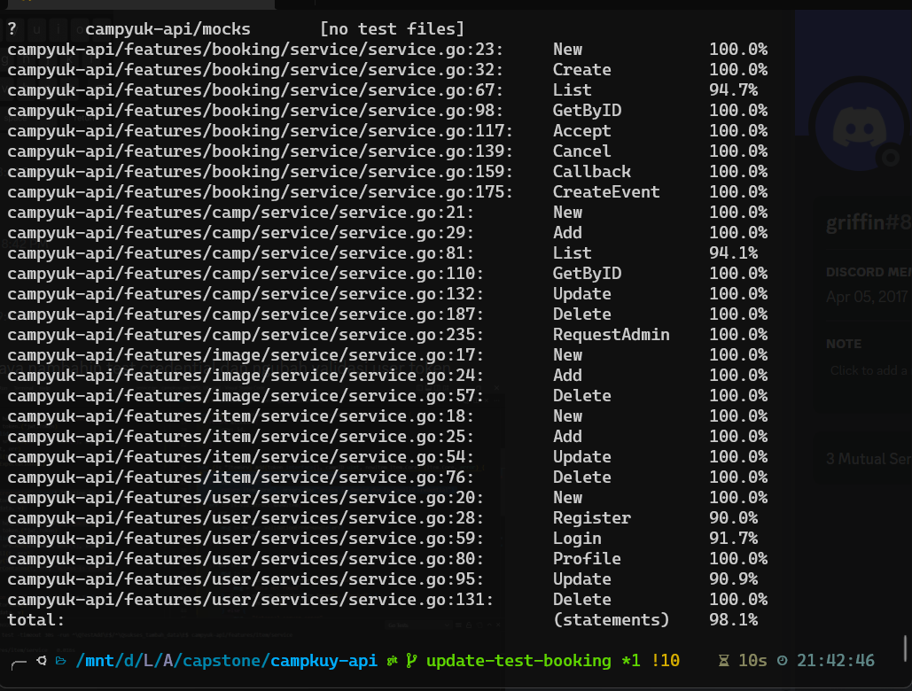

<div id="top"></div>

<!-- PROJECT LOGO -->
<br/>
<div align="center">
<!--  mengarah ke repo  -->
  <a href="https://abiasa.site/">
    
  </a>

  <p align="center">
    Final Project Capstone Program Immersive Alterra Academy
  </p>
  <a href="https://abiasa.site/"><h3 style="font-weight:bold">Go to API »</h3></a>

</div>
<br />

# Campyuk App Project

<div>
<p>
Campyuk is a platform that provides places for people who want to go camping | This project was developed using GO Language based on Clean Architecture.
</p>

</div>

<div>
<h2>Features</h2>
<details><summary>👤User</summary>
<p>
In this feature the user can login and register as a guest (cutomer) or host (camp owner)

| Method | Endpoint  | JWT Token | Role  | Function                                          |
| ------ | --------- | --------- | ----- | ------------------------------------------------- |
| POST   | /login    | NO        | -     | This is how Guest or Host log in.                 |
| POST   | /register | NO        | -     | This is how Guest or Host register their account. |
| GET    | /users    | YES       | guest | Guest obtain their account information.           |
| PUT    | /users    | YES       | guest | This is how Guest Update their profile.           |
| DELETE | /users    | YES       | guest | This is how users Deactive their profile.         |

</p>
</details>

<details><summary>🏕️Camp</summary>
<p>
In this feature, the host can manage the campground, and the admin can confirm the campground submitted by the host.

| Method | Endpoint                  | JWT Token | Role                 | Function                                                                                                                                               |
| ------ | ------------------------- | --------- | -------------------- | ------------------------------------------------------------------------------------------------------------------------------------------------------ |
| POST   | /camps                    | YES       | host                 | The process of adding new camps.                                                                                                                       |
| GET    | /camps?page={page_number} | NO/YES    | non/guest/host/admin | Non user and Guest can see the camps that have been accepted, The Host only can see his own camps, and the Admin only see camps that are still pending |
| GET    | /camps/{id}               | NO/YES    | non/guest/host/admin | Displaying booking detail by id.                                                                                                                       |
| PUT    | /camps/{id}               | YES       | host                 | The process of updating information about the camps.                                                                                                   |
| DELETE | /camps/{id}               | YES       | host                 | The process of deleting the camps.                                                                                                                     |
| PUT    | /camps/{id}/accept        | YES       | admin                | Accept the camps that proposed by host.                                                                                                                |
| PUT    | /camps/{id}/decline       | YES       | admin                | Decline the camps that proposed by host.                                                                                                               |

</p>
</details>

<details><summary>🖼️Image</summary>
<p>
In this feature, the host can manage the pictures in the campground, such as adding and deleting pictures.

| Method | Endpoint     | JWT Token | Role | Function                                            |
| ------ | ------------ | --------- | ---- | --------------------------------------------------- |
| POST   | /images      | YES       | host | The process of adding pictures to the campground.   |
| DELETE | /images/{id} | YES       | host | The process of deleting pictures to the campground. |

</p>
</details>

<details><summary>⛺Item</summary>
<p>
In this feature, the host can manage the items in the campground, such as adding and deleting items.

| Method | Endpoint    | JWT Token | Role | Function                                          |
| ------ | ----------- | --------- | ---- | ------------------------------------------------- |
| POST   | /items      | YES       | host | Melakukan proses menambah item pada camp ground.  |
| DELETE | /items/{id} | YES       | host | Melakukan proses menghapus item pada camp ground. |

</p>
</details>

<details><summary>🎫Booking</summary>
<p>
In this feature, the guest can view their booking list. Then, the host can view the booking list in their camp. The guest can cancel the transaction if they haven't made the payment. The host can accept and cancel the transaction.

| Method | Endpoint                 | JWT Token | Role       | Function                                                                                                                                                                 |
| ------ | ------------------------ | --------- | ---------- | ------------------------------------------------------------------------------------------------------------------------------------------------------------------------ |
| POST   | /bookings                | YES       | guest      | The process of booking a camp.                                                                                                                                           |
| GET    | /bookings                | YES       | guest/host | Displaying the list of bookings that belong to the currently logged-in guest. For the host role, it only displays the booking list of the currently logged in host camp. |
| GET    | /bookings/{id}           | YES       | guest/host | Displaying the booking details of the currently logged in user.                                                                                                          |
| PUT    | /bookings/{id}/accept    | YES       | host       | The process of accepting a booking transaction, which changes the booking status to "ACCEPTED."                                                                          |
| PUT    | /bookings/{id}/cancel    | YES       | guest/host | The process of cancelling a booking transaction for a user who hasn't made the payment.                                                                                  |
| POST   | /bookings/callback       | NO        | -          | Retrieving transaction data from Midtrans.                                                                                                                               |
| GET    | /bookings/{id}/oauth     | NO        | -          | The process of logging in using the Google API for authentication.                                                                                                       |
| GET    | /bookings/oauth/callback | NO        | -          | Getting the code provided by the Google API after the authentication process and creating an event in the calendar of the logged in user.                                |

</p>
</details>

</div>

<br/>

# API Documentation

[](https://app.swaggerhub.com/apis-docs/GRIFFINHENRY07_1/campyuk/1.0.0) [](https://www.postman.com/blue-rocket-532366/workspace/task-alta/collection/19389812-c3aa7b0b-cff6-4edf-abfa-e53778dbb602?action=share&creator=19389812)

<br/>

# Tech Stack

<div align="center">
    
</div>

<br/>

# Run Locally

1. Clone the project

    ```bash
    $ git clone https://github.com/Capstone-campyuk/campyuk-be.git
    ```

2. Create new database

3. Go to project directory

    ```bash
    $ cd campyuk-be
    ```

4. Dont forget to activate the credential for third party api like google oauth2, cloudinary, and midtrans
5. Create local.env using local.env.example format and fill in all value
6. Download all packages and dependencies
    ```bash
    $ go mod tidy
    ```
7. Run the program
    ```bash
    $ go run .
    ```
8. Enjoy

<br/>

# ERD


<br/>

# Unit Test

```
$ sh test.sh
```

<div align="center">
    
</div>

<br/>

# Authors

[](https://github.com/helmimuzkr)

[](https://github.com/kgriffinh)
